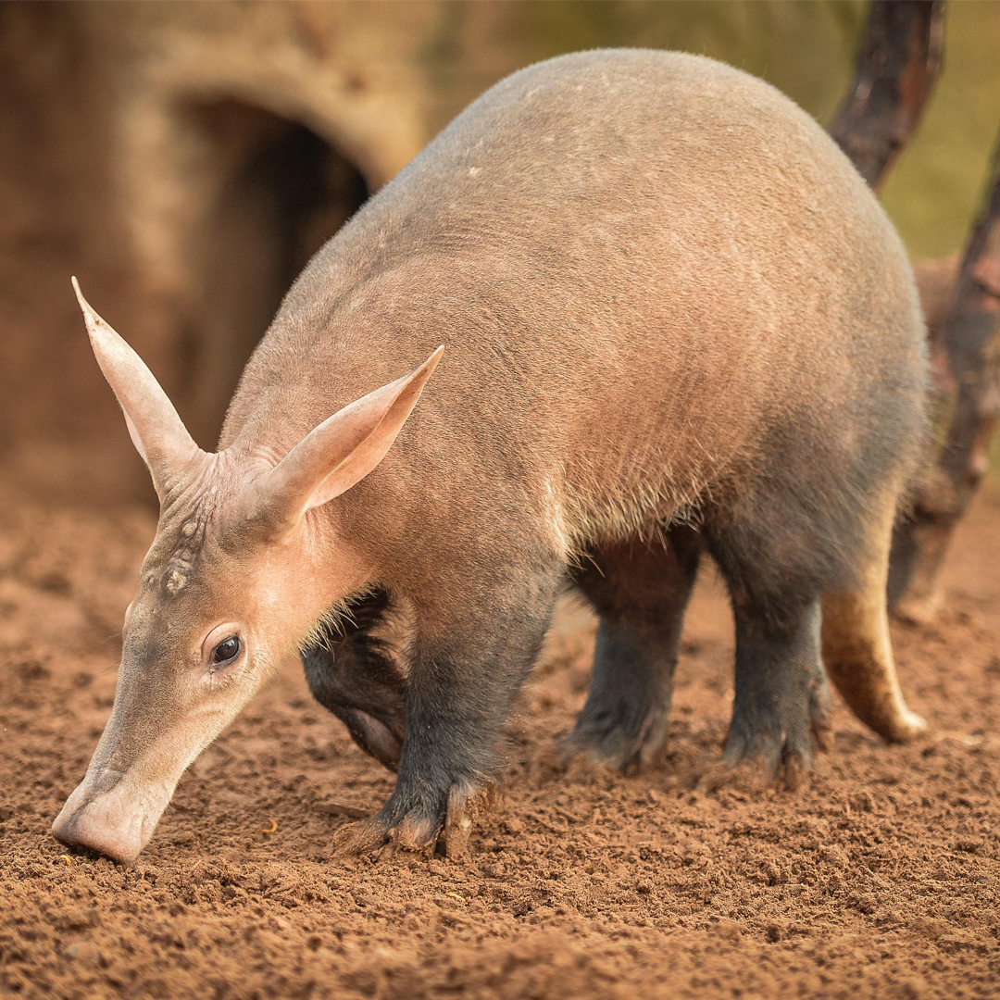

## Aardvark

One of the most incredible aardvark facts is that they can eat 50,000 ants in one meal. The aardvark looks like an amazing combination of several animals. It has a pig-like rubbery snout, a rabbits ears, the long sticky tongue of an anteater, and a naked tail like a opossum.

The aardvark, however, is not really related to any of these animals. Not even anteaters. In fact, the aardvark occupies its own order, family, and species and is all alone on its own branch in the tree of animal classification.

The aardvark is the last surviving member of an odd and primitive order of ungulates (hooved animals) and might have survived by evolving away from hooves and developing the incredibly powerful claws it uses to dig sleeping burrows and devastate termite mounds.

Amazingly, the aardvarks closest living relative is probably the African elephant.

Nocturnal for the most part, the aardvark lives a solitary life, and can be found throughout many areas of Africa, generally south of the Sahara desert, where the soil is soft enough for digging and the food supply is adequate for their appetites.

They require a fairly large territory and will travel up to 10 miles in a night as they search for food, trotting around with their nostrils working, using their excellent sense of smell to locate termite and ant mounds, but also to find buried grubs, grasshoppers or fruit.

A highly specialized animal, aardvarks dine heavily on termites and ants and may eat as many as 100 thousand bugs in a single evening of busy foraging.
 
But they do eat one specific fruit that is just as odd as they are. Known as the aardvark cucumber, or the aardvark pumpkin it is a vine that starts out as a fairly normal looking plant, growing towards the sun as most plants do. Then the ends of each branch turn back towards the ground and actually push straight down into the soil. Once the vine is about 8 inches deep, the fruit begins to grow, completely underground. The aardvark cucumber is named so because it actually requires an aardvark to dig it up, eat its fruit, and replant it by excreting the seeds.

Aardvarks use their remarkable claws to dig for aardvark cucumbers, rip open termite mounds and ant hills, and also to dig long burrows where they sleep during the heat of the day. They are such excellent diggers they may actually dig a hole on the spot and dive in to hide from predators.

Lions, hyenas, leopards and African wild dogs all prey on aardvarks, but not without a fight. Adult aardvarks are 2 feet tall and can weigh over 180 pounds. They use their iron-hard claws for defense, sometimes rearing up on their hind legs, sometimes rolling over on their backs and striking out with all four feet. They can also use their powerful tail as a weapon. The tail is very thick at the base and can batter an opponent, but is also whip-like towards the end, and can deliver a stinging lash.

# What Do Aardvarks Eat?
The aardvark is insectivorous, feeding almost exclusively on insects, but supplementing with the unusual aardvark cucumber, a curious subterranean fruit.

Most aardvarks would prefer to eat only ants, but population limitations and changes in the seasons force them to consume enormous amounts of termites as well.

Imagine the number of quarter inch long insects it takes to power a 130 pound aardvark!  Though they are not "anteaters", they hunt and forage exactly as the South American anteaters do. They tear open ant hills capturing the scurrying masses with a 16 to 20 inch tongue that is covered with glue-like saliva.

The stinging and biting of ants and termites can't seem to penetrate the aardvarks tough hide.

Aardvarks can break into termite mounds that are hard as concrete, and can decimate an entire colony, lapping up all in their wake. They will ingest insects through their nostrils as well, sometimes inhaling the last of them from nooks and crannies with a few mighty snorts of their substantial schnoz.

aardvark sticks out its toungue
An individual aardvark may have a territory of many square miles and may not return to the same area for several weeks, giving the insect population a chance to rebound.

The aardvark is mostly nocturnal, somewhat nomadic and quite shy leaving allot of their lifestyle a bit of a mystery.

